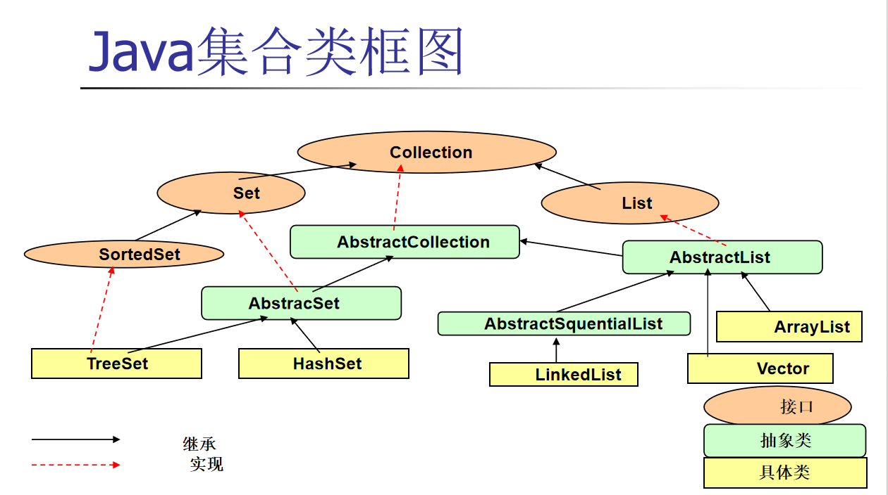
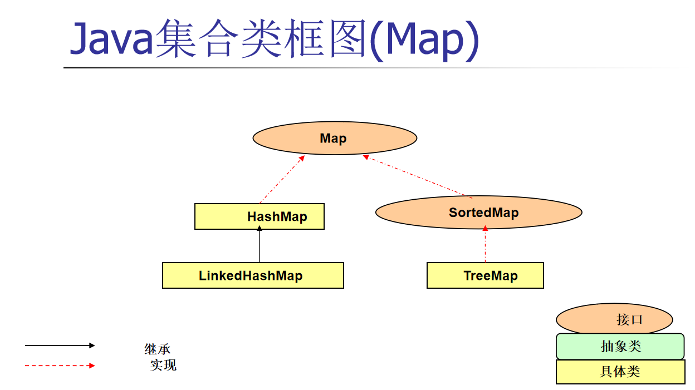

# 集合类

## Java中常见的集合类框图

# 集合相关类说明

 Java 集合类包括 `Collection`、`Set`、`List` 和 `Map` 的重要方法，以及 `Set`、`List` 和 `Map` 的常见实现类。

### 1. **`Collection` 接口**
`Collection` 是集合框架的根接口，定义了所有集合类的基本操作。

#### 重要方法：
- 【重要】**`boolean add(E e)`**：添加一个元素到集合中。
- 【重要】**`boolean remove(Object o)`**：移除集合中的指定元素。
- 【重要】**`boolean contains(Object o)`**：检查集合中是否包含指定元素。
- 【重要】**`int size()`**：返回集合中的元素数量。
- 【重要】**`boolean isEmpty()`**：检查集合是否为空。
- **`void clear()`**：清空集合中的所有元素。
- 【重要】**`Iterator<E> iterator()`**：返回一个迭代器，用于遍历集合中的元素。
- **`Object[] toArray()`**：将集合中的元素转换为一个数组。
- **`<T> T[] toArray(T[] a)`**：将集合中的元素转换为一个指定类型的数组。
- 【重要】**`boolean addAll(Collection<? extends E> c)`**：将指定集合中的所有元素添加到当前集合中。
- **`boolean removeAll(Collection<?> c)`**：移除当前集合中所有指定集合中的元素。
- **`boolean retainAll(Collection<?> c)`**：只保留当前集合中包含在指定集合中的元素。

### 2. **`List` 接口**
`List` 是一个有序集合，允许重复的元素。它提供了基于索引的访问方式。

#### 重要方法：
- 【重要】**`void add(int index, E element)`**：在指定索引处插入一个元素。
- 【重要】**`E get(int index)`**：返回指定索引处的元素。
- 【重要】**`E set(int index, E element)`**：替换指定索引处的元素。
- 【重要】**`E remove(int index)`**：移除指定索引处的元素，并返回被移除的元素。
- 【重要】**`int indexOf(Object o)`**：返回指定元素在列表中的第一次出现的索引。
- 【重要】**`int lastIndexOf(Object o)`**：返回指定元素在列表中的最后一次出现的索引。
- **`ListIterator<E> listIterator()`**：返回一个列表迭代器，用于双向遍历列表。
- **`ListIterator<E> listIterator(int index)`**：从指定索引处开始返回一个列表迭代器。
- **`List<E> subList(int fromIndex, int toIndex)`**：返回从 `fromIndex` 到 `toIndex`（不包括）的子列表。

#### 常见实现类：
- 【重要】**`ArrayList`**：基于动态数组实现的 `List`，支持快速随机访问。
- **`LinkedList`**：基于双向链表实现的 `List`，支持高效的插入和删除操作。
- **`Vector`**：线程安全的动态数组实现的 `List`（已过时，推荐使用 `Collections.synchronizedList` 包装 `ArrayList`）。
- **`Stack`**：基于 `Vector` 实现的后进先出（LIFO）的栈结构。

### 3. **`Set` 接口**
`Set` 是一个不允许重复元素的集合。它不保证元素的顺序。

#### 重要方法：见 **`Collection` 接口**
#### 常见实现类：
- 【重要】**`HashSet`**：基于哈希表实现的 `Set`，提供快速的查找、插入和删除操作。
- **`LinkedHashSet`**：基于哈希表和链表实现的 `Set`，保持元素的插入顺序。
- 【重要】**`TreeSet`**：基于红黑树实现的 `Set`，元素按照自然顺序或指定的比较器顺序排序。

### 4. **`Map` 接口**
`Map` 是一种键值对的集合，不允许重复的键，但允许重复的值。它提供了基于键的快速查找功能。

#### 重要方法：
- 【重要】**`void put(K key, V value)`**：将指定的键值对添加到映射中。
- 【重要】**`V get(Object key)`**：返回指定键所映射的值。
- 【重要】**`V remove(Object key)`**：移除指定键的映射，并返回被移除的值。
- 【重要】**`boolean containsKey(Object key)`**：检查映射中是否包含指定的键。
- 【重要】**`boolean containsValue(Object value)`**：检查映射中是否包含指定的值。
- 【重要】**`int size()`**：返回映射中的键值对数量。
- **`boolean isEmpty()`**：检查映射是否为空。
- 【重要】**`void clear()`**：清空映射中的所有键值对。
- **`Set<K> keySet()`**：返回映射中所有键的集合视图。
- **`Collection<V> values()`**：返回映射中所有值的集合视图。
- **`Set<Map.Entry<K, V>> entrySet()`**：返回映射中所有键值对的集合视图。
- **`void putAll(Map<? extends K, ? extends V> m)`**：将指定映射中的所有键值对添加到当前映射中。

#### 常见实现类：
- 【重要】**`HashMap`**：基于哈希表实现的 `Map`，提供快速的查找、插入和删除操作。
- **`LinkedHashMap`**：基于哈希表和链表实现的 `Map`，保持键值对的插入顺序。
- 【重要】**`TreeMap`**：基于红黑树实现的 `Map`，键按照自然顺序或指定的比较器顺序排序。
- **`Hashtable`**：线程安全的哈希表实现的 `Map`（已过时，推荐使用 `ConcurrentHashMap`）。
- **`ConcurrentHashMap`**：线程安全的哈希表实现的 `Map`，适用于多线程环境。

### 总结
- **`Collection`**：定义了所有集合类的基本操作，如添加、删除、遍历等。
- **`List`**：有序集合，支持基于索引的操作，允许重复元素。
- **`Set`**：不允许重复元素的集合，不保证元素顺序。
- **`Map`**：键值对集合，不允许重复的键，支持基于键的快速查找。

这些接口和实现类构成了 Java 集合框架的核心，提供了灵活的数据存储和操作功能。

**在讨论泛型以前，集合类中操作的元素都是Object。**

