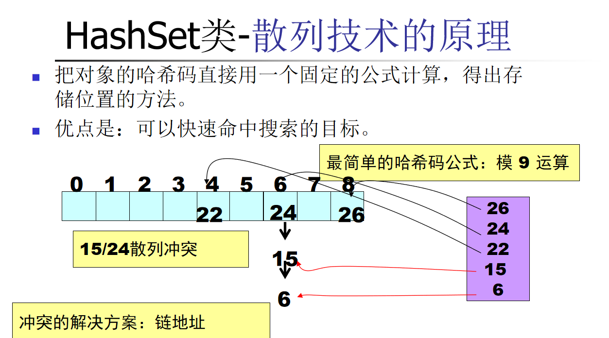

考虑如下问题：

1. 商品推荐系统中的去重，在一个电商平台上，需要为用户推荐商品，但推荐列表中不能包含用户已经购买过的商品。
2. 日志分析中的唯一IP地址，在服务器日志中，统计访问过网站的唯一IP地址数量，得到所谓的IP访问量。
3. 微信公众号的一个文章，点过赞的不能再点赞
4. 一个投票，已经投过票的不能再投票，一个薅羊毛的活动，参加过的不能再参加。
5. A发了一个微信朋友圈，下面有10个A的好友点赞，B看到这个朋友圈的时候，在上面10个点赞（留言）里面只能看见B好友的点赞（留言）
6. 统计红楼梦中有多少个不同的汉字。
7. 当你看微信一篇有打赏的文章的时候，文章下面会显示前几十个打赏用户的头像，如果里面打赏的用户有你的好友，那么显示在前面的一定是你的好友。
8. 计算两个人共同好友的数量。

这些问题大部分时候需要Set来解决。

集合解决的本质问题是什么？


# Set介绍（暂时不考虑泛型和迭代器Iterator）

在Java中，`Set` 是一个接口，它表示一个不包含重复元素的集合。以下是几种常见的 `Set` 实现类（如 `HashSet`、`TreeSet` 和 `LinkedHashSet`）的用法示例，以及它们的特点和适用场景。

## 1. **`Collection` 接口**

`Collection` 是集合框架的根接口，定义了所有集合类的基本操作。

#### 重要方法：

- **`boolean add(E e)`**：添加一个元素到集合中。
- **`boolean remove(Object o)`**：移除集合中的指定元素。
- **`boolean contains(Object o)`**：检查集合中是否包含指定元素。
- **`int size()`**：返回集合中的元素数量。
- **`boolean isEmpty()`**：检查集合是否为空。
- **`void clear()`**：清空集合中的所有元素。
- **`Iterator<E> iterator()`**：返回一个迭代器，用于遍历集合中的元素。
- **`Object[] toArray()`**：将集合中的元素转换为一个数组。
- **`<T> T[] toArray(T[] a)`**：将集合中的元素转换为一个指定类型的数组。
- **`boolean addAll(Collection<? extends E> c)`**：将指定集合中的所有元素添加到当前集合中。
- **`boolean removeAll(Collection<?> c)`**：移除当前集合中所有指定集合中的元素。
- **`boolean retainAll(Collection<?> c)`**：只保留当前集合中包含在指定集合中的元素。

## 2. **`Set` 接口**

- 不允许重复元素
- 它不保证元素的顺序。

Set的定义

```java
public interface Set<E> extends Collection<E> {

...

}
```


#### 重要方法[**`Collection` 接口**]：

## 3. 常见实现类：

- **`HashSet`**：基于哈希表实现的 `Set`，提供快速的查找、插入和删除操作。
- **`TreeSet`**：基于红黑树实现的 `Set`，元素按照自然顺序或指定的比较器顺序排序。

## 4.  Set举例子

- 
  Set`此遍历时的顺序可能与添加顺序不同。可以使用  for-each进行遍历：


- Set中的元素是不重复的


- Set不保证元素的顺序


```java
import java.util.HashSet;
import java.util.Set; 

public class Demo {
	public static void main(String[] args) {
		Set set = new HashSet();
		set.add("天");
		set.add("津");
		set.add("大");
		set.add("学");
		set.add("大");
		
		System.out.println("size="+set.size());
		String sum="";
		for (Object obj : set) {
			System.out.println(obj);
		    sum=sum+(String)obj;
		}
		System.out.println("sum="+sum);
	}
}
```

下面的结构把set替换为list/map也同样适用，以后会具体讲述这种结构

```
		for (Object obj : set) {
			System.out.println(obj);
		    sum=sum+(String)obj;
		}
		
```

统一一个字符串不同字符的数量：

```java
import java.util.HashSet;
import java.util.Set;

public class Demo {
	public static void main(String[] args) {
		Set set = new HashSet();
		String str = "我是天津大学一名学生";
		char[] chars = str.toCharArray();
		for (int i = 0; i<chars.length; i++) {
			set.add(chars[i]);
		}
		System.out.println("不同字符数量： " + set.size());
		for(Object o : set) {
			System.out.println(o);
		}
	}
}
```

## 5 Set的一个重要实现HashSet

 在 Java 中，`HashSet` 是一个基于哈希表的集合，它继承自 `AbstractSet` 类并实现了 `Set` 接口。`HashSet` 不保证元素的顺序，并且不允许重复元素。以下是 `HashSet` 的使用方法和一些常见操作的示例。

### 用法举例：

```java
import java.util.HashSet;
import java.util.Set;

public class Demo {
	public static void main(String[] args) {
		Set set = new HashSet();		
		int[] numbers = { 26, 24, 22, 15, 6 };
		for (int i = 0; i < numbers.length; i++) {
			System.out.println(numbers[i]+" hascode= "+Integer.valueOf(numbers[i]).hashCode());
			set.add(numbers[i]);
		}
		for (Object i : set) {
			System.out.println(i);
		}
	}
}

```


输出如下：

```
26 hascode= 26
24 hascode= 24
22 hascode= 22
15 hascode= 15
6 hascode= 6
22
6
24
26
15
```

### 理解HashSet工作原理：




### Integer.hashCode()

    @Override
    public int hashCode() {
        return Integer.hashCode(value);
    }

### String.hashCode() 代码如下，想想为什么这样实现？

    public int hashCode() {
        int h = hash;
        if (h == 0 && value.length > 0) {
            char val[] = value;
            for (int i = 0; i < value.length; i++) {
                h = 31 * h + val[i];
            }
            hash = h;
        }
        return h;
    }


### HashSet一个例子，运行下面代码，看一下输出是什么？

```
import java.util.HashSet;
public class Demo {
    public static void main(String[] args) {
        HashSet set = new HashSet();
        set.add("zhang");
        set.add("zhang");
        System.out.println("size="+set.size());
        for (Object obj : set) {
            System.out.println(obj);
        }
    }
}
```


### HashSet一个例子

```
import java.util.HashSet;

class Person {
    private String name;
	@Override
	public String toString() {
		return "Person [name=" + name + "]";
	}
	public Person(String name) {
		super();
		this.name = name;
	}
}

public class Demo {
    public static void main(String[] args) {
        HashSet set = new HashSet();
        set.add(new Person("zhang"));
        set.add(new Person("zhang"));
        System.out.println("size="+set.size());
        for (Object obj : set) {
            System.out.println(obj);
        }
    }
}
```

### HashSet一个例子

```java
import java.util.HashSet;
class Person {
    private String name;
	@Override
	public String toString() {
		return "Person [name=" + name + "]";
	}
	public Person(String name) {
		this.name = name;
	}
	@Override
	public int hashCode() {
		return name.hashCode();
	}
	@Override
	public boolean equals(Object obj) {
		if (obj instanceof Person){
			Person that=(Person)obj;
			return that.name.equals(this.name);
		}else {
			return false;
		}		
	}
}

public class Demo {
    public static void main(String[] args) {
        HashSet set = new HashSet();
        set.add(new Person("zhang"));
        set.add(new Person("zhang"));
        System.out.println("size="+set.size());
        for (Object obj : set) {
            System.out.println(obj);
        }
    }
}
```


### hashCode有什么要求？

正确实现 `hashCode()` 方法对于确保对象在哈希表中的正确存储和查找至关重要，对自定义对象hashCode()要求：

#### 1. **一致性**

- **要求**：在同一个程序运行过程中，如果对象的 `equals()` 方法所用的信息没有改变，那么 `hashCode()` 方法必须始终返回相同的整数。

#### 2. **相等性**

- **要求**：如果两个对象通过 `equals()` 方法比较是相等的，那么它们的 `hashCode()` 方法必须返回相同的值。

#### 3. **不相等性（不一定要求）**

- **要求**：如果两个对象通过 `equals()` 方法比较是不相等的，它们的 `hashCode()` 方法返回的哈希码值不一定需要不同。

#### 4. **性能**

- **要求**：`hashCode()` 方法的实现应该尽量高效，避免过于复杂的计算。

#### 5. **分布均匀性**

- **要求**：`hashCode()` 方法的返回值应该尽可能均匀分布，以减少哈希冲突。

#### 6. 实现 `hashCode()` 方法的建议

- **使用 `Objects.hash()`**：Java 7 引入了 `Objects.hash()` 方法，可以方便地生成哈希码。它接受多个字段作为参数，并返回一个合适的哈希码。

  ```java
  @Override
  public int hashCode() {
      return Objects.hash(field1, field2, field3);
  }
  ```


- **实现的另一种方法：**

  如果系统中ID是字符串（身份证号/学号）则直接返回这个字符串 hashCode() ，直接返回这个唯一对象的hashCode就行 

```java
@Override
public int hashCode() {
	return id.hashCode();
}
```


## 6 Set的一个重要实现`TreeSet`

在 Java 中，`TreeSet` 是一个基于红黑树的有序集合，它继承自 `AbstractSet` 类并实现了 `SortedSet` 接口。`TreeSet` 中的元素会按照自然顺序（升序）进行排序，或者根据在创建时提供的比较器进行排序。以下是 `TreeSet` 的使用方法和一些常见操作的示例。

### 1. 自然排序
自然排序是指按照元素的自然顺序进行排序。对于基本数据类型的包装类（如 `Integer`、`Double` 等）和字符串（`String`），Java 已经定义了自然顺序。例如，数字按照从小到大排序，字符串按照字典顺序排序。

#### 示例：自然排序
```java
import java.util.TreeSet;

public class Demo {
    public static void main(String[] args) {
        TreeSet set = new TreeSet();
        set.add(10);
        set.add(5);
        set.add(20);
        set.add(15);
        for (Object num : set) {
            System.out.println(num);
        }
    }
}
```

#### 示例：自然排序另一个例子

```
import java.util.TreeSet;
class MyObj implements Comparable {
	private int id;
	public MyObj(int id) {
		super();
		this.id = id;
	}	
	@Override
	public String toString() {
		return "MyObj [id=" + id + "]";
	}	
	@Override
	public int compareTo(Object o) {
		MyObj that = (MyObj) o;
		return Integer.valueOf(Math.abs(this.id)).compareTo(Math.abs(that.id));
	}
}

public class Demo {
	public static void main(String[] args) {
		TreeSet set = new TreeSet();
		set.add(new MyObj(-7));
		set.add(new MyObj(1));
		set.add(new MyObj(3)); 
		for (Object num : set) {
			System.out.println(num);
		}
	}
}
```


### 2. 比较器排序

如果需要按照自定义的顺序排序，可以提供一个比较器（`Comparator`）。比较器是一个接口，需要实现 `compare()` 方法来定义排序规则。

Comparator接口定义：

```java
@FunctionalInterface
public interface Comparator<T> {
int compare(T o1, T o2);
....
}
```

#### 示例：比较器排序

```java
import java.util.Comparator;
import java.util.Set;
import java.util.TreeSet;
class Student  {
	String name;
	int heigt;
	int score;
	public Student(String name, int heigt, int score) {
		super();
		this.name = name;
		this.heigt = heigt;
		this.score = score;
	}
	@Override
	public String toString() {
		return "Student [name=" + name + ", heigt=" + heigt + ", score=" + score + "]";
	} 
}
class ScoreComparator implements Comparator {  
    public int compare(Object o1, Object o2) {
    	Student s1=(Student)o1;
    	Student s2=(Student)o2;
        return Integer.valueOf(s1.score).compareTo(s2.score);
    }
}
class HeightComparator implements Comparator {  
    public int compare(Object o1, Object o2) {
    	Student s1=(Student)o1;
    	Student s2=(Student)o2;
        return Integer.valueOf(s1.heigt).compareTo(s2.heigt);
    }
}
class NameComparator implements Comparator {  
    public int compare(Object o1, Object o2) {
    	Student s1=(Student)o1;
    	Student s2=(Student)o2;
        return s1.name.compareTo(s2.name);
    }
}
public class Demo {
	public static void main(String[] args) {
		TreeSet set = new TreeSet(new ScoreComparator());
		set.add(new Student("li",180,650));
		set.add(new Student("wang",175,640));
		set.add(new Student("zhang",185,600));
		System.out.println("ScoreComparator()");
		printSet(set);
		
		TreeSet set2 = new TreeSet(new HeightComparator());
		set2.addAll(set);
		System.out.println("HeightComparator()");
		printSet(set2);
		
		TreeSet set3 = new TreeSet(new NameComparator());
		System.out.println("NameComparator()");
		set3.addAll(set);
		printSet(set3);
		
	}
	public static void printSet(Set set) {
		for (Object num : set) {
			System.out.println(num);
		}	
		System.out.println();
	}
}
```

### 3. TreeSet独有方法

#### （1）获取第一个和最后一个元素
- `first()`：返回第一个元素（最小值）。
- `last()`：返回最后一个元素（最大值）。
```java
Integer first = treeSet.first(); // 返回最小值
Integer last = treeSet.last();   // 返回最大值
```

#### （2）获取子集
- `subSet(fromElement, toElement)`：返回介于 `fromElement` 和 `toElement` 之间的子集（不包括 `toElement`）。
```java
TreeSet<Integer> subset = treeSet.subSet(5, 15);
```

- `headSet(toElement)`：返回小于 `toElement` 的子集。
```java
TreeSet<Integer> headSet = treeSet.headSet(10);
```

- `tailSet(fromElement)`：返回大于等于 `fromElement` 的子集。
```java
TreeSet<Integer> tailSet = treeSet.tailSet(10);
```

例如：

```
import java.util.TreeSet;

public class Demo {
    public static void main(String[] args) {
        TreeSet treeSet = new TreeSet();
        treeSet.add(10);
        treeSet.add(20);
        treeSet.add(30);
        treeSet.add(40);
        treeSet.add(50);
        System.out.println("原始 TreeSet: " + treeSet);
        SortedSet subSet = treeSet.subSet(20, 40);
        System.out.println("subSet(20, 40): " + subSet); // 输出：[20, 30]
        SortedSet headSet = treeSet.headSet(30);
        System.out.println("headSet(30): " + headSet); // 输出：[10, 20]
        SortedSet tailSet = treeSet.tailSet(30);
        System.out.println("tailSet(30): " + tailSet); // 输出：[30, 40, 50]
    }

}
```


### 4 关于HashSet和TreeSet另一个例子

```
import java.util.*;

// 定义Person类
class Person implements Comparable {
	String pid;
	String name;

	public Person(String pid, String name) {
		this.pid = pid;
		this.name = name;
	}

	@Override
	public int compareTo(Object other) {
		System.out.println(this.pid + "\tcompareTo\t" + ((Person) other).pid);
		return this.pid.compareTo(((Person) other).pid);
	}

	@Override
	public boolean equals(Object obj) {

		if (this == obj)
			return true;
		if (obj == null || getClass() != obj.getClass())
			return false;
		Person person = (Person) obj;
		System.out.println(this.pid + "\tequals\t" + person.pid);
		return pid.equals(person.pid) && name.equals(person.name);
	}

	@Override
	public int hashCode() {
		System.out.println(this.pid + "\thashCode\t");
		return Objects.hash(pid);
	}

	@Override
	public String toString() {
		return "Person{" + "pid='" + pid + '\'' + ", name='" + name + '\'' + '}';
	}
}

public class Demo {
	public static void main(String[] args) {
		Person p1 = new Person("001", "Li");
		Person p2 = new Person("002", "Zhao");
		Person p3 = new Person("003", "Liu");
		Person p4 = new Person("001", "Zhang");
		TreeSet<Person> treeSet = new TreeSet<>();
		treeSet.add(p1);
		treeSet.add(p2);
		treeSet.add(p3);
		treeSet.add(p4);
		System.out.println("TreeSet中的元素：");
		for (Person person : treeSet) {
			System.out.println(person);
		}
		// 将Person对象放入HashSet
		HashSet<Person> hashSet = new HashSet<>();
		hashSet.add(p1);
		hashSet.add(p2);
		hashSet.add(p3);
		hashSet.add(p4);
		System.out.println("\nHashSet中的元素：");
		for (Person person : hashSet) {
			System.out.println(person);
		}
	}
}
```

看看输出的结果，想想为什么？


**结论：**

**TreeSet依赖对象中的compareTo方法**

**HashSet依赖对象中的hashCode和equals方法**


## 7 注意事项

1. **线程不安全**：`HashSet` 和 `TreeSet` 都不是线程安全的集合。如果需要在多线程环境中使用，可以使用 `Collections.synchronizedSet()` 方法将其包装为线程安全的集合。
2. **性能**：`HashSet` 的性能通常优于 `TreeSet`，因为它基于哈希表实现，添加和查找操作的时间复杂度为 O(1)。

## 8 思考题

如果HashSet中所有对象hashCode都返回0会怎样？