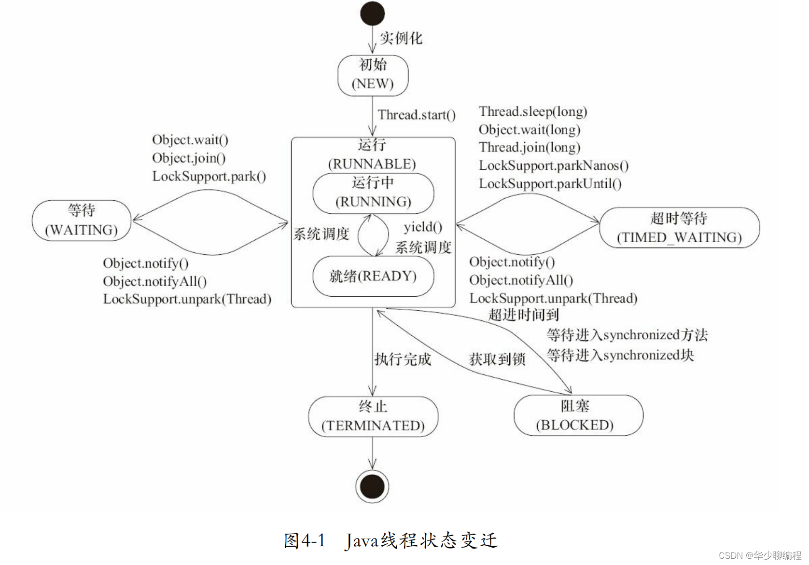

线程在其生命周期中会经历多个状态，这些状态反映了线程在运行过程中的不同阶段。以下是 Java 中线程的几个主要状态及其特点：

### 1. **新建状态（New）**
- **特点**：线程被创建，但尚未启动。
- **行为**：线程对象已经创建，但尚未调用 `start()` 方法。
- **示例**：
  ```java
  Thread thread = new Thread(() -> System.out.println("Hello"));
  // 此时线程处于新建状态
  ```

### 2. **就绪状态（Runnable）**
- **特点**：线程已经启动，等待 CPU 时间片分配。
- **行为**：线程调用了 `start()` 方法后进入就绪状态，等待被线程调度器选中运行。
- **示例**：
  ```java
  thread.start(); // 调用 start() 后线程进入就绪状态
  ```

### 3. **运行状态（Running）**
- **特点**：线程正在执行。
- **行为**：线程被线程调度器选中，分配到 CPU 上运行。
- **示例**：
  ```java
  // 在线程的 run() 方法中执行的代码
  public void run() {
      System.out.println("Thread is running");
  }
  ```

### 4. **阻塞状态（Blocked）**
- **特点**：线程暂时停止执行，等待某个条件满足。
- **行为**：
  - 线程尝试获取一个被其他线程锁定的同步块（`synchronized`）。
  - 线程调用了 `wait()` 方法。
  - 线程调用了 `join()` 方法等待另一个线程完成。
- **示例**：
  ```java
  synchronized (lock) {
      while (conditionNotMet) {
          lock.wait(); // 线程进入阻塞状态
      }
  }
  ```

### 5. **等待状态（Waiting）**
- **特点**：线程等待某个条件发生，但不参与线程调度。
- **行为**：
  - 调用了 `wait()` 方法。
  - 调用了 `join()` 方法等待另一个线程完成。
  - 调用了 `Thread.sleep()` 方法。
- **示例**：
  ```java
  thread.join(); // 线程进入等待状态
  ```

### 6. **超时等待状态（Timed Waiting）**
- **特点**：线程等待某个条件发生，但设置了超时时间。
- **行为**：
  - 调用了 `wait(long timeout)` 方法。
  - 调用了 `sleep(long millis)` 方法。
  - 调用了 `join(long millis)` 方法。
- **示例**：
  
  ```java
  Thread.sleep(1000); // 线程进入超时等待状态
  ```

### 7. **终止状态（Terminated）**
- **特点**：线程已经执行完毕或被终止。
- **行为**：
  - 线程的 `run()` 方法执行完成。
  - 线程被强制终止（不推荐，如调用 `stop()` 方法）。
- **示例**：
  ```java
  public void run() {
      System.out.println("Thread is running");
      // 线程执行完毕后进入终止状态
  }
  ```

### 线程状态的转换
线程状态之间可以相互转换，以下是常见的转换关系：
- **新建状态** → **就绪状态**：调用 `start()` 方法。
- **就绪状态** → **运行状态**：被线程调度器选中。
- **运行状态** → **阻塞状态**：尝试获取锁或调用 `wait()`。
- **运行状态** → **等待状态**：调用 `wait()` 或 `join()`。
- **运行状态** → **超时等待状态**：调用 `wait(long timeout)` 或 `sleep(long millis)`。
- **运行状态** → **终止状态**：`run()` 方法执行完成。
- **阻塞状态** → **就绪状态**：锁被释放或调用 `notify()`/`notifyAll()`。
- **等待状态** → **就绪状态**：调用 `notify()`/`notifyAll()` 或等待的线程完成。
- **超时等待状态** → **就绪状态**：超时时间结束。




 **`sleep()`、`wait()` 和 `yield()` 的区别：**

| 特性/方法        | `Thread.sleep()`                | `Object.wait()`                     | `Thread.yield()`         |
| ---------------- | ------------------------------- | ----------------------------------- | ------------------------ |
| **功能**         | 暂停线程指定时间                | 等待并释放锁                        | 让出 CPU 时间片          |
| **是否释放锁**   | 不释放锁                        | 释放锁                              | 不释放锁                 |
| **是否需要锁**   | 不需要                          | 需要在同步代码块中                  | 不需要                   |
| **适用场景**     | 延时操作                        | 线程协作，等待条件满足              | 提示调度器让其他线程运行 |
| **是否抛出异常** | 可能抛出 `InterruptedException` | 可能抛出 `InterruptedException`     | 不抛出异常               |
| **线程状态**     | TIMED_WAITING 或 WAITING        | WAITING 或 TIMED_WAITING            | RUNNABLE                 |
| **示例代码**     | `Thread.sleep(1000);`           | `synchronized(obj) { obj.wait(); }` | `Thread.yield();`        |

