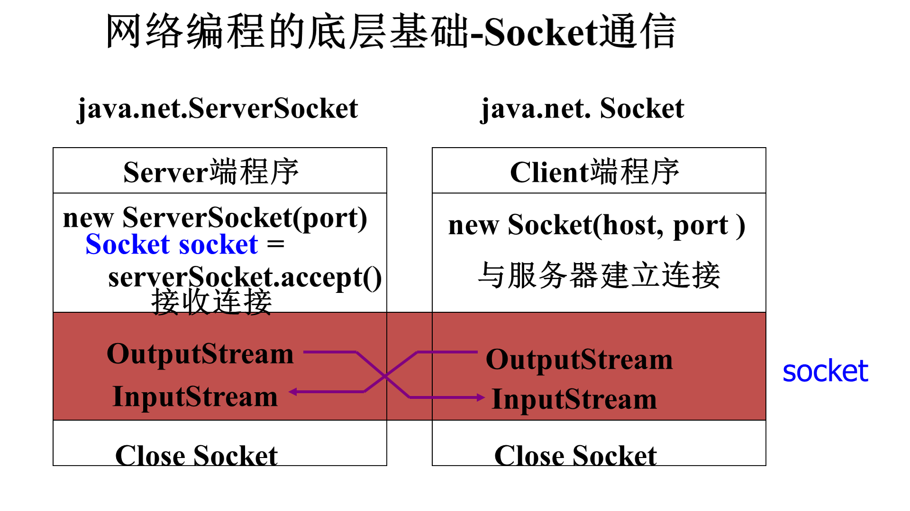

Java 网络编程主要依赖于 `java.net` 包，其中包含了许多重要的类和方法，用于实现基于 TCP/IP 和 UDP/IP 的网络通信。




## 1. 重要的类

### 1. **`java.net.Socket`**
`Socket` 类用于实现基于 TCP 的**客户端**套接字，用于与服务器建立连接并进行数据传输。

#### 重要方法：
- **`Socket(String host, int port)`**：连接到指定主机和端口的服务器。
- **`getInputStream()`**：获取输入流，用于从服务器接收数据。
- **`getOutputStream()`**：获取输出流，用于向服务器发送数据。
- **`close()`**：关闭套接字。

#### 示例：
```java
Socket socket = new Socket("localhost", 12345);
InputStream input = socket.getInputStream();
OutputStream output = socket.getOutputStream();
socket.close();
```

### 2. **`java.net.ServerSocket`**
`ServerSocket` 类用于实现基于 TCP 的**服务器端**套接字，用于监听客户端连接请求。

#### 重要方法：
- **`ServerSocket(int port)`**：在指定端口上创建服务器套接字。
- **`accept()`**：接受一个客户端连接，返回一个新的 `Socket` 对象。
- **`close()`**：关闭服务器套接字。

#### 示例：
```java
ServerSocket serverSocket = new ServerSocket(12345);
Socket clientSocket = serverSocket.accept();
serverSocket.close();
```

### 3. **`java.net.InetAddress`**
`InetAddress` 类用于表示 IP 地址，提供方法来获取和解析 IP 地址。

#### 重要方法：
- **`getByName(String host)`**：根据主机名获取 `InetAddress` 对象。
- **`getLocalHost()`**：获取本地主机的 `InetAddress` 对象。
- **`getHostAddress()`**：获取 IP 地址的字符串表示形式。

#### 示例：
```java
InetAddress address = InetAddress.getByName("localhost");
System.out.println("IP Address: " + address.getHostAddress());
```

### 4. **`java.net.URL`**
`URL` 类用于表示统一资源定位符，提供方法来访问和操作网络资源。

#### 重要方法：
- **`URL(String spec)`**：根据 URL 字符串创建 `URL` 对象。
- **`openConnection()`**：打开到该 URL 的连接。
- **`getContent()`**：获取 URL 指向的内容。

#### 示例：
```java
URL url = new URL("http://example.com");
URLConnection connection = url.openConnection();
InputStream input = connection.getInputStream();
```

### 4. **`java.net.HttpURLConnection`**
`HttpURLConnection` 类用于实现 HTTP 协议的连接，提供方法来发送 HTTP 请求和接收响应。

#### 重要方法：
- **`setRequestMethod(String method)`**：设置 HTTP 请求方法（如 GET、POST）。
- **`setRequestProperty(String key, String value)`**：设置 HTTP 请求头。
- **`getInputStream()`**：获取响应输入流。
- **`getResponseCode()`**：获取 HTTP 响应码。

#### 示例：
```java
URL url = new URL("http://example.com");
HttpURLConnection connection = (HttpURLConnection) url.openConnection();
connection.setRequestMethod("GET");
int responseCode = connection.getResponseCode();
InputStream input = connection.getInputStream();
```


## 2. 网络编程例子

### 1 一个最简陋的浏览器(模仿http协议访问一个网站)

```java
 
import java.net.*;
import java.io.*;
import java.util.*;

/**
 * 实现一个最简陋的浏览器
 * @author Administrator
 *
 */
public class Demo {

	public static void main(String args[]) {
		Socket socket = null;
		String host = "www.163.com";
		 
		int port = 80;
		try {
			socket = new Socket(host, port); // 与HTTPServer建立 连接

			/* 创建HTTP请求 */
			StringBuffer sb = new StringBuffer("GET http://www.163.com// HTTP/1.1\r\n");
			//StringBuffer sb = new StringBuffer("GET http://probe.aibtc.top/ HTTP/1.1\r\n");
			
			sb.append("Accept: */*\r\n");
			sb.append("Accept-Language: zh-cn\r\n");
			// sb.append("Accept-Encoding: gzip, deflate\r\n");
			sb.append("User-Agent: HTTPClient\r\n");
			// sb.append("Host: localhost:8080\r\n");
			sb.append("Host: www.163.com:80 \r\n");
			sb.append("Connection: Keep-Alive\r\n\r\n");

			/* 发送HTTP请求 */
			OutputStream socketOut = socket.getOutputStream(); // 获得输出流
			socketOut.write(sb.toString().getBytes());

			Thread.sleep(2000); // 睡眠2秒，等待响应结果

			/* 接收响应结果 */
			InputStream socketIn = socket.getInputStream(); // 获得输入流
			int size = socketIn.available();
			byte[] buffer = new byte[size];
			socketIn.read(buffer);
			System.out.println(new String(buffer, "UTF-8")); // 打印响应结果
			System.out.println("ok");

		} catch (Exception e) {
			e.printStackTrace();
		} finally {
			try {
				socket.close();
			} catch (Exception e) {
				e.printStackTrace();
			}
		}
	} 
}

```

### 2. 扫描一个服务器的所有端口

```java

import java.io.IOException;
import java.net.Socket;

public class Demo {

	public Demo() {
		// TODO Auto-generated constructor stub
	}

	public static void main(String[] args) {
		//远程的地址，可以是IP 地址，也可以是域名
		String address = "www.tju.edu.cn";
		for (int port = 80; port < 10000; port++) {
			Socket socket =null;
			try {
				System.out.println("scan "+address +":" + port);
				socket = new Socket(address, port);	
				//远程主机名
				System.out.println("hostname=" + socket.getInetAddress().getHostName());
				//远程地址
				System.out.println("ip=" + socket.getInetAddress().getHostAddress());				
				System.out.println(address + " listen on port:" + port);
			} catch (IOException e) {
				System.out.println(address + " port=" + port + " connect error:" + e);
			}finally {
				if(socket!=null) {
					try {
						socket.close();
					} catch (IOException e) {
						// TODO Auto-generated catch block
						e.printStackTrace();
					}
				}
			}
		}
	}

}
```

### 3. 一个最简单的HTTP服务器

```java

import java.io.*;
import java.net.*;

/**
 * 一个 HTTPServer的例子
 * 
 * @author Administrator
 *
 */
public class Demo {

	public static void main(String args[]) {
		int port;
		ServerSocket serverSocket;

		try {
			port = Integer.parseInt(args[0]);
		} catch (Exception e) {
			System.out.println("port = 8080 (默认)");
			port = 8080; // 默认端口为8080
		}

		try {
			serverSocket = new ServerSocket(port);
			System.out.println("服务器正在监听端口：" + serverSocket.getLocalPort());

			while (true) { // 服务器在一个无限循环中不断接收来自客户的TCP连接请求
				try {
					// 等待客户的TCP连接请求
					final Socket socket = serverSocket.accept();
					System.out.println("建立了与客户的一个新的TCP连接，该客户的地址为：" + socket.getInetAddress() + ":" + socket.getPort());

					service(socket); // 响应客户请求
				} catch (Exception e) {
					e.printStackTrace();
				}
			} // #while
		} catch (Exception e) {
			e.printStackTrace();
		}
	}

	/** 响应客户的HTTP请求 */
	public static void service(Socket socket) throws Exception {

		/* 读取HTTP请求信息 */
		InputStream socketIn = socket.getInputStream(); // 获得输入流
		Thread.sleep(500); // 睡眠500毫秒，等待HTTP请求
		int size = socketIn.available();
		byte[] requestBuffer = new byte[size];
		socketIn.read(requestBuffer);
		String request = new String(requestBuffer);
		System.out.println(request); // 打印HTTP请求数据

		String contentType = "text/html";
		// String contentType = "application/zip";

		/* 创建HTTP响应结果 */
		// HTTP响应的第一行
		// String responseFirstLine = "HTTP/1.1 200 OK\r\n";
		String responseFirstLine = "HTTP/1.1 404 Not Found \r\n";
		// HTTP响应头
		String responseHeader = "Content-Type:" + contentType + "\r\n\r\n";
		// 获得读取响应正文数据的输入流

		/* 发送HTTP响应结果 */
		OutputStream socketOut = socket.getOutputStream(); // 获得输出流
		// 发送HTTP响应的第一行
		socketOut.write(responseFirstLine.getBytes());
		// 发送HTTP响应的头
		socketOut.write(responseHeader.getBytes());
		// 发送HTTP响应的正文
		String content = "hellow 12345 " + new java.util.Date().toString();
		byte[] buffer = content.getBytes();
		socketOut.write(buffer, 0, buffer.length);

		Thread.sleep(1000); // 睡眠1秒，等待客户接收HTTP响应结果
		socket.close(); // 关闭TCP连接

	}
}

```

### 4. 一个客户 服务器端连接的例子

1. 服务器端监听指定端口。
2. 客户端连接服务器后，每隔 1 秒发送一个整数。
3. 服务器端接收后输出。

#### 服务器端代码
服务器端使用 `ServerSocket` 监听指定端口，接受客户端连接，并读取客户端发送的数据。

```java
import java.io.*;
import java.net.*;
/**
 * 注意，这个代码的文件名字必须叫 TCPServer，包名为空
 *
 */
public class TCPServer {
    public static void main(String[] args) throws IOException {
        int port = 12345; // 监听端口
        ServerSocket serverSocket = new ServerSocket(port);
        System.out.println("Server is listening on port " + port);

        // 等待客户端连接
        Socket clientSocket = serverSocket.accept();
        System.out.println("Accepted connection from " + clientSocket.getInetAddress());

        // 读取客户端发送的数据
        try (BufferedReader in = new BufferedReader(new InputStreamReader(clientSocket.getInputStream()))) {
            String inputLine;
            while ((inputLine = in.readLine()) != null) {
                System.out.println("Received from client: " + inputLine);
            }
        } catch (IOException e) {
            e.printStackTrace();
        } finally {
            try {
                clientSocket.close();
                serverSocket.close();
            } catch (IOException e) {
                e.printStackTrace();
            }
        }
    }
}

```

#### 客户端代码
客户端使用 `Socket` 连接到服务器，并每隔 1 秒发送一个整数。

```java
import java.io.*;
import java.net.*;
import java.util.concurrent.TimeUnit;

/**
 * 注意，这个代码的文件名字必须叫 TCPclient，包名为空
 *
 */
public class TCPClient {
	public static void main(String[] args) throws IOException, InterruptedException {
		String host = "localhost"; // 服务器地址
		int port = 12345; // 服务器端口

		// 创建 Socket 连接到服务器
		Socket socket = new Socket(host, port);
		System.out.println("Connected to server");

		// 发送数据到服务器
		try (PrintWriter out = new PrintWriter(socket.getOutputStream(), true)) {
			int count = 0;
			while (count < 10) {
				String line = String.valueOf(count++);
				System.out.println("send to server:" + line);
				out.println(line);

				TimeUnit.SECONDS.sleep(1); // 每隔 1 秒发送一个整数
			}
		} catch (IOException | InterruptedException e) {
			e.printStackTrace();
		} finally {
			try {
				socket.close();
			} catch (IOException e) {
				e.printStackTrace();
			}
		}
	}
}

```

运行程序：

找到TCPClient.class/TCPServer.class所在的目录(假设TCPServer.class位于D:\code_demo\bin ，打开两个命令行窗口，分别执行如下命令：

```
CD D:\code_demo\bin
java TCPServer
```

```
CD D:\code_demo\bin
java TCPClient
```

